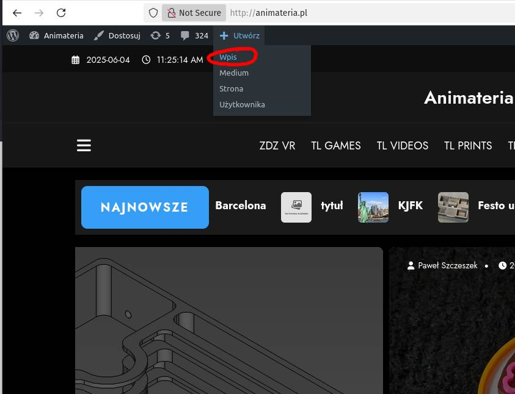
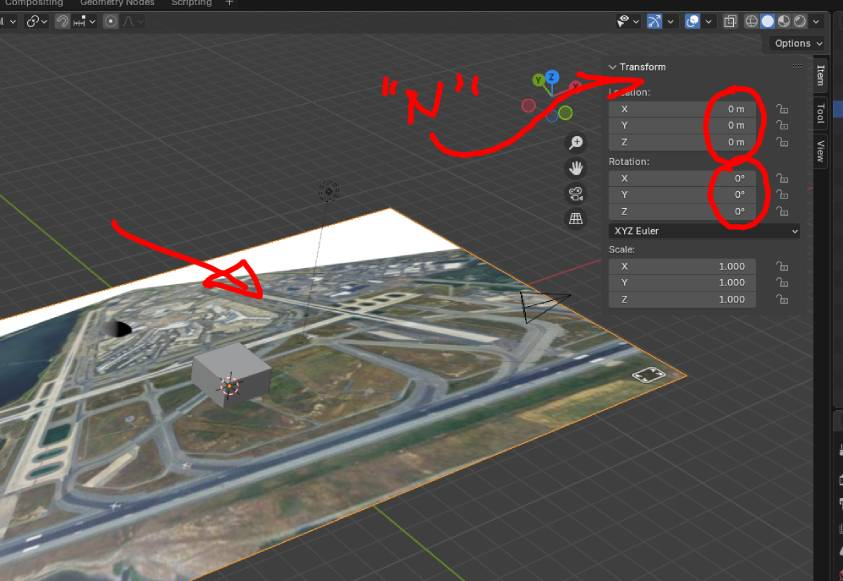
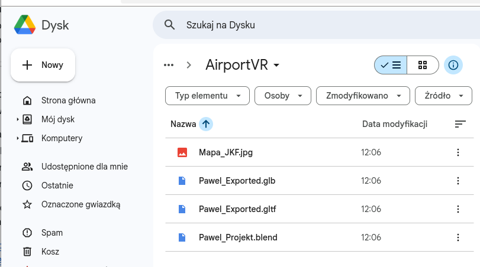
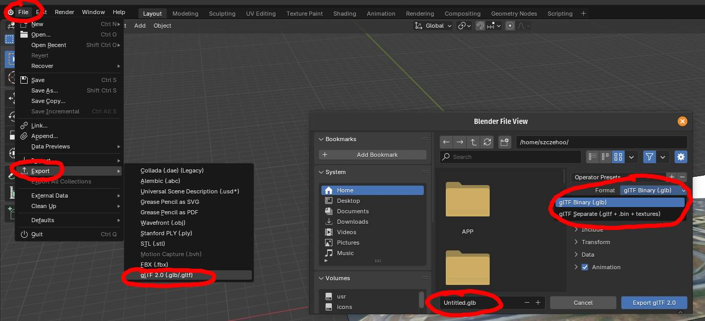

# INF240-AirportVR

### Zadanie polega na przygotowaniu modelu 3D w środowisku WebXR pozwalającym na publikacje treści XR w środowisku webowym.

---

#### I. Prace przygotowawcze

1. Wybierz ulubiony port lotniczy (który posiada budynki infrastruktury)
2. Znajdź w Google Maps i zaproponuj wybrany port lotniczy (jeśli nie deklarowałeś na lekcji to sprawdź pod adresem http://animateria.pl/tl-airports/ jakie lokacje są już zajęte). Można zabezpieczyć się przed zajęciem przez kogfoś innego poprzez rejestrację i stworzenie artykułu na portalu animateria.pl (szczegóły poniżej)

---

#### II. Artykuł na portalu Animateria.pl
1. Aby usystematyzować informacje na temat wybranych przez was portów, przygotuj artykuł z ogólnodostępnymi informacjami na temat twojego lotniska i opublikuj na stronie http://animateria.pl/tl-airports/ (poniżej instrukcja jak to zrobić).
2. Zarejestruj się na stronie http://animateria.pl/register wypełniając formularz i wysyłając dane klikając "Zarejestruj się". Rejestracja jest bezpieczna a dostęp do waszych danych podanych w formularzu mam tylko ja jako nauczyciel. Jeśli nie chcecie wyświetlać swojego imienia i nazwiska jko podpis pod artykułem, to proszę podać dowolny Nick (pseudonim) w polu "podpis pod artykułem". Email jest wymagany w celu ochrony przed spamem.
3. Po rejestracji i/lub zalogowaniu utwórz wpis:

zdefiniuj tytuł (najlepiej aby w tytule był tylko kod ICAO) i zredaguj treść dotyczącą wybranego portu. Jako wzór potraktuj mój wpis http://animateria.pl/2025/04/07/port-lotniczy-johna-f-kennedyego-w-nowym-jorku/ (bez prezentacji 3D, które uzupełnimy na zajęciach) zawierający co najmniej jedno zdjęcie i informacje o porcie lotniczym. Tworzenie wpisu przebiega podobnie jak w edytorze tekstu poprzez wpisywanie tekstów i wstawianie obrazów i/lub tabelek jako bloków. W tworzeniu wpisu można się wspomóc tutorialem (np: https://www.youtube.com/watch?v=AUd718XYvF4) ale powinniście poradzić sobie bez przygotowania. Jeśli napotkasz problemy podczas rejestracji lub tworzenia wpisu, stwórz dokument tekstowy (Word/OpenDocument) zawierający artykuł i wyślij go na dysk Google lub przynieś na pendrive.

4. Dodaj zdjęcie (znaleione w internecie) i podpisz podając źródło.
5. Ustaw obrazek wyróżniający.

---

#### III. Model 3D
1.  Utwórz i zapisz zrzut ekranu z map google zawierający cały pas startowy i budynki infrastruktury lotniska.
2.  Zainstaluj darmowy edytor 3D (zalecany Blender 3D który znajdziesz w sklepie Windows lub na stronie [blender3d.org](https://www.blender.org/download/)
3.  Przeciągnij i upuść obrazek z mapą do okna widoku 3D programu blender a następnie zresetuj jego obrót i położenie w panelu numerycznym wywoływanym klawiszem "N" jak na poniższym obrazku.

Poćwicz nawigację w scenie 3D blendera. Można wspomóc się tutorialem wideo (np takim: https://www.youtube.com/watch?v=qHijANQziUM), jednak sądzę że nawigacja oraz podstawowe manipulacje obiektu są dostępne dla was bez przygotowania (także dla nieobecnych na zajęciach na których to ćwiczyliśmy)
- klawisze 7,3,1 w bloku numerycznym jako podstawowe widoki ortogonalne
- rolka myszy - ZOOM
- SHIFT+ŚRODKOWY PRZYCISK MYSZY do przesuwania widoku (bez orbitowania)
- klawisze G, R, S jako podstawowe przekształcenia
- SHIFT + D jako polecenie powiel (duplikuj)

  Proces tworzenia sceny powinien przebiegać w następujący sposób:
  - zaznacz i powiel (SHIFT+D) istniejącą kostkę (lub utwórz w menu Add > Mesh > Cube) w widoku ortogonalnym (bez perspektywy) z góry.
  - ustaw powieloną kostkę na mapie w miejscu widocznego budynku
  - przesuń, przeskaluj, obróć klawiszami skrótów G,R,S lub przy pomocy manipulatora, powtarzaj proces aż utworzysz kilkanaście budynków.
5. Zapisz projekt jako dokument pod swoją nazwą (np. PawelJFK.blend) poleceniem "File > Save As"
6. Spróbuj wyeksportować scenę dodatkowo do formatu *.glb i *.gltf
6. Upewnij się że skompletowałeś wszystkie pliki:
  - Mapa.jpg/png,
  - Projekt.blend,
  - Exported.glb,
  - Exported.gltf
 

    
  i wyślij je do swojego katalogu klasowego na dysku Google, lub na pendrive, który przynieszesz na zajęcia

2E - https://drive.google.com/drive/folders/1y9zdZvpfhf5KW2bGVN0xbmmKqPvmygYE?usp=drive_link

2e - https://drive.google.com/drive/folders/11XycYjXIGGrUwkTPo0wS9cIGp920LpMU?usp=drive_link
  
7. Na lekcji dodamy pliki 3D do wpisu i będziemy je eksplorować w VR

---

#### IV. Zaawansowany model 3D (dla chętnych)
1. Dla zaawansowanych: poszukaj darmowego modelu 3D samolotu który można pobrac np spod następujących adresów:
    - www.free3d.com
    - www.thingiverse.com
    - www.sketchfab.com
    - www.cgtrader.com
    - https://free3d.com
    - www.trbosquid.com
    - https://3dwarehouse.sketchup.com
    - https://pinshape.com
    - https://hum3d.com/free
    - https://done3d.com
    - https://cults3d.com
  - rozpakuj pobrane archiwum i przeciągnij do widoku 3D modle samolotu (plik w formacie obj, glb, gltf lub stl)
  - przekształć model samolotu tak jak budynki (powielanie, skalowanie, obracanie)
2. Przed exportem do glb i gltf przekonwertuj mapę na geometrię: Object > Convert > Convert to mesh plane
3. Upewnij się ze rozmiar sceny nie przekracza kilku metrów a położenie sceny jest zbliżone do środka sceny (aby przekształcić całość, zaznacz wszystko "A" i dokonaj przekształceń całej sceny)
4. Wyeksportuj do formatu glb i gltf

